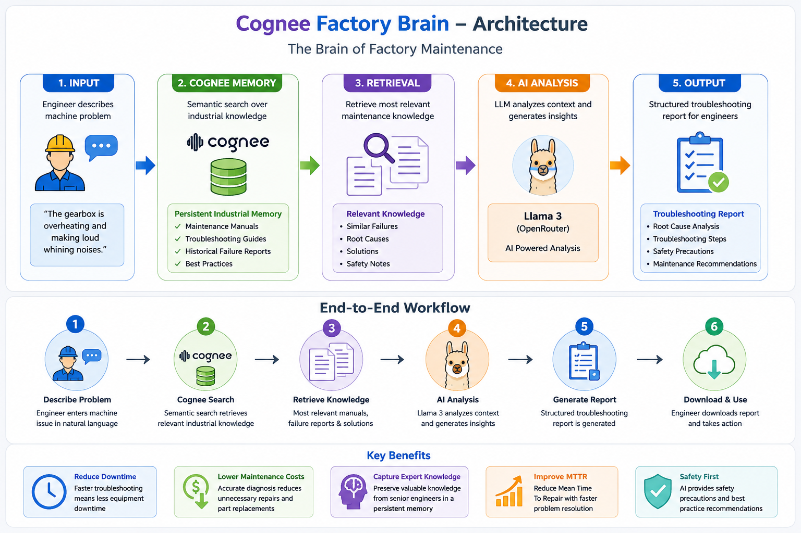

# 🧠 Cognee Factory Brain

<h3 align="center">
The Brain of Factory Maintenance
</h3>

<p align="center">
An AI-powered industrial memory system that helps maintenance engineers diagnose machine failures using <b>Cognee Persistent Memory</b> and <b>Llama 3</b>.
</p>

<p align="center">


</p>

---

# 🏭 Overview

Industrial maintenance engineers spend significant time searching maintenance manuals, troubleshooting guides, and historical failure reports to diagnose equipment issues.

**Cognee Factory Brain** transforms these documents into a **persistent organizational memory**. Engineers can simply describe a machine problem in natural language and instantly receive:

- Historical maintenance knowledge
- Similar failure cases
- Root cause analysis
- Troubleshooting recommendations
- Safety precautions
- Maintenance actions

---

# 🏗 System Architecture

<p align="center">

</p>

---

# 🚀 Problem Statement

Traditional industrial troubleshooting depends heavily on:

- Experienced engineers
- Paper maintenance manuals
- Trial-and-error diagnosis
- Searching hundreds of pages

This results in:

- Increased downtime
- Higher maintenance cost
- Longer Mean Time To Repair (MTTR)
- Knowledge loss when experienced engineers leave

---

# 💡 Solution

Cognee Factory Brain creates a **persistent industrial memory** using **Cognee Cloud**.

When an engineer reports a machine problem:

1. Search industrial memory using Cognee.
2. Retrieve relevant maintenance knowledge.
3. Analyze retrieved context using **Llama 3**.
4. Generate an AI troubleshooting report.
5. **Remember validated incidents** by storing new maintenance knowledge back into Cognee.
6. Continuously improve the organization's maintenance memory.

---

# 🔄 Memory Lifecycle

The project demonstrates Cognee's memory lifecycle.

| Feature | Status |
|----------|--------|
| ✅ Remember | Store validated maintenance incidents into Cognee |
| ✅ Recall | Retrieve relevant historical maintenance knowledge |
| ✅ Search | Semantic search across maintenance manuals |
| 🔄 Continuous Memory | Organization knowledge grows over time |

---

# ✨ Features

- 🧠 Persistent Industrial Memory
- 🔍 Semantic Search using Cognee
- 🤖 AI Root Cause Analysis
- 📚 Maintenance Manual Knowledge Retrieval
- ⚠ Safety Recommendations
- 📄 Download Troubleshooting Reports
- 💾 Remember New Maintenance Incidents
- 🎨 Modern Streamlit Dashboard

---

# ⚙ Workflow

```text
Engineer reports machine problem
            │
            ▼
Cognee Semantic Search
            │
            ▼
Retrieve Historical Maintenance Knowledge
            │
            ▼
Llama 3 Analysis
            │
            ▼
AI Troubleshooting Report
            │
            ▼
Engineer validates solution
            │
            ▼
Remember Incident
            │
            ▼
Cognee Memory Updated
```

---

# 🛠 Tech Stack

| Layer | Technology |
|--------|------------|
| Frontend | Streamlit |
| Backend | Python |
| Memory | Cognee Cloud |
| LLM | Llama 3 via OpenRouter |
| Search | Cognee Semantic Search |
| APIs | Cognee HTTP API, OpenRouter API |

---

# 📂 Project Structure

```text
industrial-memory-assistant/

├── app.py
├── cognee_client.py
├── llm.py
├── components.py
├── styles.py
├── requirements.txt
├── .env
├── README.md
└── docs
    └── architecture.png
```

---

# ⚙ Installation

```bash
git clone <repository-url>

cd industrial-memory-assistant

python -m venv venv

venv\Scripts\activate

pip install -r requirements.txt

streamlit run app.py
```

---

# 🔑 Environment Variables

```env
COGNEE_BASE_URL=

COGNEE_API_KEY=

OPENROUTER_API_KEY=

OPENROUTER_MODEL=
```

---

# 📖 Example Questions

- What causes low oil pressure in reciprocating air compressors?
- My centrifugal pump is noisy and vibrating.
- The gearbox is overheating and making loud whining noises.
- Bearing has dirt embedment and scoring.
- The induction motor trips immediately after startup.
- The hydraulic system loses pressure after 15 minutes.
- How can I troubleshoot a motor controller with welded contacts?

---

# 🧠 Remember Function

Unlike a traditional RAG application, Cognee Factory Brain allows engineers to preserve organizational knowledge.

After reviewing an AI-generated troubleshooting report, engineers can click **Remember Incident** to store validated maintenance knowledge into Cognee.

This enables the system to continuously build a richer maintenance knowledge base that can assist future engineers facing similar problems.

---

# 🌟 Why Cognee?

Traditional RAG systems only retrieve information.

Cognee Factory Brain leverages **Cognee's persistent memory** to:

- Remember new incidents
- Recall historical maintenance knowledge
- Build an evolving organizational memory
- Reduce troubleshooting time
- Preserve expert knowledge

---

# 🔮 Future Roadmap

- 📄 Upload PDF, DOCX and CSV maintenance logs
- 📈 Predictive Maintenance using IoT Sensors
- 🏭 Multi-factory Knowledge Sharing
- 🎤 Voice-based Troubleshooting Assistant
- 📊 Equipment Health Dashboard
- 🔔 Predictive Failure Alerts

---

# 🤖 AI Assistance Disclosure

This project was developed with assistance from AI tools (including ChatGPT) for implementation support, debugging, UI design, documentation, and code review.

All project architecture, integration decisions, validation, and final implementation were completed by the project author.

---

# 👨‍💻 Built For

🏆 **Cognee Memory Hackathon**

Building the future of persistent AI memory for industrial maintenance.